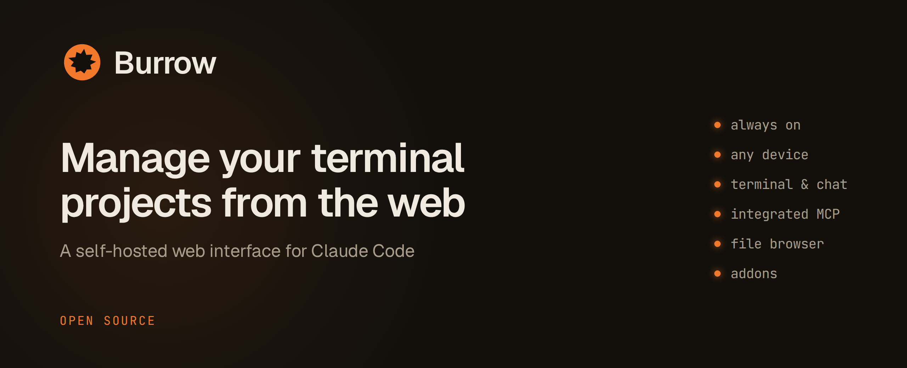
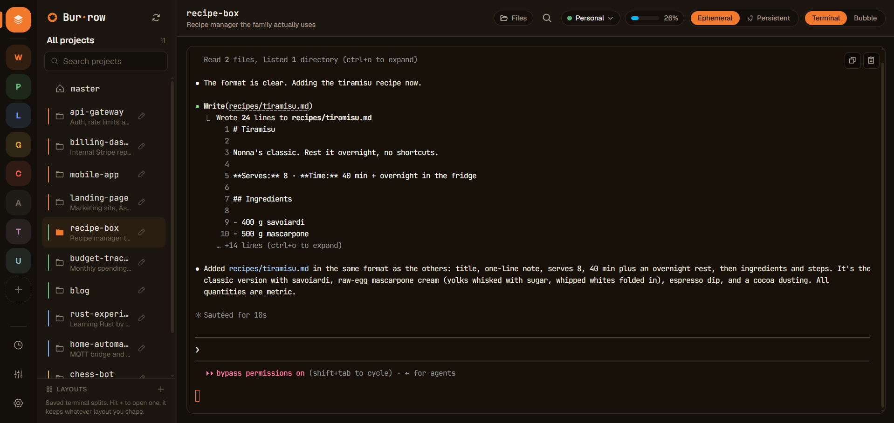

<p align="center">
  
</p>

# Burrow

**A self-hosted web interface for Claude Code.** Manage dozens of projects, switch between them
with ease, and they will keep working on their tasks.

Every directory within Burrow's scope becomes a project with its own Claude Code session running on
the host rather than in your browser, giving it the ability to keep running even if you close the
tab. Start something on your laptop, close it, open Burrow on your phone, and you are back in the
same session with its output and running processes intact. No more carrying the laptop around half
open so a session survives the walk home.

Note that Burrow works best always-on, meaning on a device that can stay on: a cloud personal
server, or any other machine that can run for long periods. From there you connect with your
personal devices, using an SSH tunnel or a VPN, or through an addon.

## Features

- **Persistent sessions.** Each project runs in tmux on the host. Disconnecting detaches instead of
  killing, and reconnecting reattaches. Projects marked as persistent keep their session alive after
  you leave, everything else winds down once idle.
- **Terminal and chat.** Use the real Claude Code TUI, or a chat interface. Both drive the same
  session and write the same history file.
- **Groups.** Organise projects into colored groups and jump between them from the sidebar rail.
  Groups are only labels: on disk, projects stay plain folders.
- **File browser.** Browse, upload and download files in a project.
- **Search.** Full-text and project search across your session history.
- **Scheduler.** Send a message to Claude in any session at a set time.
- **Split view.** Side by side layouts allowing you to work on multiple projects at the same time.
- **Multi-device.** Responsive interface and mobile support.

<p align="center">
  
</p>

## Requirements

- Node.js 20 or newer
- tmux
- [Claude Code](https://claude.com/claude-code) CLI
- Linux, or Windows with WSL2

## Installation

```sh
git clone https://github.com/AlbeeDev/Burrow.git
cd Burrow
./install.sh
npm start
```

The installer asks where your projects should live and which port to use, checks your machine for
the requirements above, and prints the URL when it is done.

The projects folder must be empty or not yet exist. The installer will create it for you. Every
directory inside it is treated as a project.

### Docker

```sh
git clone https://github.com/AlbeeDev/Burrow.git
cd Burrow
node scripts/docker-setup.mjs
docker compose up -d --build
```

The setup script asks the same questions, plus whether to include a Tailscale sidecar that publishes
Burrow on your tailnet over HTTPS.

## Updating

```sh
git pull
npm install
npm start
```

`npm install` keeps your configuration, refreshes dependencies and rebuilds the frontend. On
Docker, `git pull` and then `docker compose up -d --build` instead; sessions survive the restart
only if the tmux service from `deploy/` is installed.

## Security

Burrow gives anyone who can reach it a shell on the host. It runs Claude Code with
`--dangerously-skip-permissions` and has no built-in authentication.

It binds to `127.0.0.1` by default and refuses to bind publicly without `BURROW_TOKEN` set. To reach
it from other devices, put it behind Tailscale, WireGuard, or an SSH tunnel. Do not expose it
directly to the internet.

See [docs/trust.md](docs/trust.md) for the full picture, including how to isolate a second user.

## Burrow MCP

Burrow ships with its own MCP server. It gives Claude the ability to show one or more files on
screen: the tool manages a list of files internally, and Burrow mirrors that list in a panel next
to the terminal.

Formats supported: images, markdown, PDF, video, audio, and rendered HTML pages. Markdown renders
as a formatted document, which also makes the panel a comfortable place to read anything longer
than a few paragraphs.

There is nothing to configure. Burrow registers the server on startup, and every session it runs,
terminal or chat, can use it.


## Addons

**Tailscale.** If the `tailscale` CLI is installed and signed in, Burrow can publish itself on your
tailnet from Settings. It runs `tailscale serve`; the Tailscale daemon handles HTTPS and the proxy.
Tailscale has been this project's preference, but other ways of reaching the machine work just as
well. If you would like yours supported as an addon, open an issue.

**Plan usage.** Shows how much of your Claude plan you have used, in the header. The provider is
[claude-usage](https://github.com/AlbeeDev/claude-usage), which reads the plan usage of the Claude
account you are logged into. Burrow detects it on your PATH; any executable with that name that
outputs the format in [USAGE-PROVIDER.md](USAGE-PROVIDER.md) works too.

## Documentation

- [Architecture](docs/architecture.md)
- [Configuration](docs/configuration.md)
- [Security and trust model](docs/trust.md)

## Feedback

Burrow has been shaped by one person's daily use, and feedback is what it needs most. If something
confused you, broke, or does not fit how you work,
[open an issue](https://github.com/AlbeeDev/Burrow/issues). "I expected X and got Y" is already a
useful report, and that includes anything this README led you to expect wrongly.

## Credits

PTY and session handling adapted from OpenClaw, MIT. See
[THIRD-PARTY-NOTICES.md](THIRD-PARTY-NOTICES.md).

## License

MIT. See [LICENSE](LICENSE).
